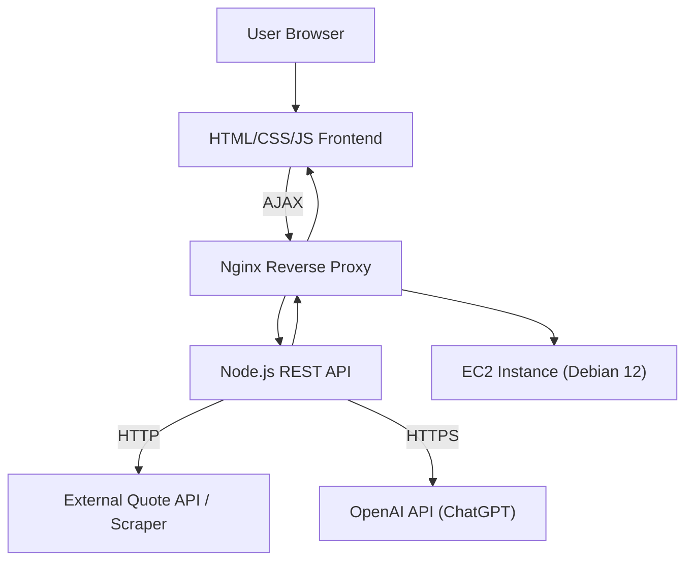

# Gen Z Quotes Translator – Project Outline

## Technical Description

This project is a simple web application that allows users to select a type of quote, fetches a relevant quote from an external source, sends it to ChatGPT for translation into “Gen Z brain-rot dialect,” and displays the result. The application consists of a static frontend (HTML/CSS/JS) and a minimal Node.js backend that exposes a REST API. The backend handles fetching the quote, interacting with the ChatGPT API, and returning the translated quote to the frontend. The app will be deployed on an EC2 instance running Debian 12, served via nginx at https://quotes.iotacloud.tech.

---

## System Architecture

---

## Step-by-Step Implementation Plan

### 1. Project Setup
- Initialize a new Node.js project (`npm init`).
- Set up basic project structure:
  - `/public` for static frontend files (HTML, CSS, JS)
  - `/server` for backend code

### 2. Frontend Implementation
- **HTML**: Create a simple page with:
  - A drop-down for quote type selection
  - A button to fetch/translate
  - A section to display the translated quote
- **CSS**: Minimal styling for clarity and mobile-friendliness
- **JS**:
  - Listen for selection and button click
  - Make AJAX (fetch) request to backend API with selected quote type
  - Display the translated quote in the UI
- **Quote Types**:
  - Zen
  - Bible Scripture
  - LDS Quote
  - Geek
  - Software

### 3. Backend Implementation (Node.js)
- Use Express.js for REST API
- **Endpoints:**
  - `GET /api/quote?type=TYPE`
    - Receives quote type from frontend
    - Fetches a quote from an external API or scrapes a page
    - Sends the quote to ChatGPT API with a prompt to “translate” it
    - Returns the translated quote as JSON
- **External Quote Source:**
  - Some will scraped from pages that show a random quote on load or each day, and some from listicles that should have one randomly chosen.
  - Types and sources:
    - Zen, https://zenquotes.io/ scraped
    - Bible Scripture, https://www.verseoftheday.com/ scraped
    - LDS Quote, https://ldssotd.com/ scraped
    - Geek, https://www.wired.com/2010/01/100-quotes-every-geek-should-know/ listicle
    - Software, https://softwarequotes.com/quote-of-the-day scraped
- **ChatGPT Integration:**
  - Use OpenAI’s API (requires API key)
  - Format prompt: “Translate this quote to Gen Z brain-rot dialect: [QUOTE]”
- **CORS**: Enable if frontend and backend are on different origins

### 4. Deployment
- **Backend**: Deploy Node.js app on EC2 (Debian 12)
- **Frontend**: Serve static files via Express or directly via nginx
- **nginx**: Configure as a reverse proxy to forward `/api` requests to Node.js backend and serve static files
- **Domain**: Ensure https://quotes.iotacloud.tech points to your EC2 instance and is SSL-enabled

### 5. Testing
- Test locally (frontend and backend)
- Test on EC2 instance via nginx
- Validate API integration and error handling

### 6. (Optional) Enhancements
- Add more quote types
- Improve UI/UX
- Add loading indicators, error messages, etc.

---

## Summary Table

| Component   | Technology         | Purpose                                      |
|-------------|--------------------|----------------------------------------------|
| Frontend    | HTML/CSS/JS        | UI, user interaction, AJAX requests          |
| Backend     | Node.js + Express  | REST API, quote fetching, ChatGPT integration|
| Quote Source| Public API/Scraper | Provides original quotes                     |
| AI Service  | OpenAI API         | Translates quote to Gen Z dialect            |
| Hosting     | EC2 + nginx        | Serves app, reverse proxy, SSL               |

---

## Next Steps

1. Scaffold Node.js backend and static frontend.
2. Implement frontend UI and AJAX logic.
3. Implement backend API, quote fetching, and ChatGPT integration.
4. Deploy to EC2 and configure nginx.
5. Test end-to-end. 